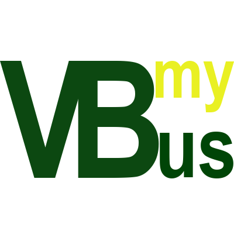

# ioBroker.myvbus

**Tests:** 
  
## ioBroker Adapter for Resol VBus

This adapter connects ioBroker to various VBus-based devices using resol-vbus, a JavaScript library for the acquisition of RESOL VBus data, provided by Daniel Wippermann.

<https://github.com/danielwippermann/resol-vbus>

<https://www.npmjs.com/package/resol-vbus>

## Features

* Enables reading of the measurement data from various RESOL(R) VBus(R) devices - preferably solar and system controllers from the DeltaSol(R) series including built-in heat quantity meters (HQM) - using DL3 or DL2 data loggers, KM2 communication modules, VBus/LAN interface adapters or serial/LAN gateways locally via TCP/IP.
* Device access using the VBus/USB serial interface adapter or via VBus.net(R) using DLx/KMx is also supported.
* Processes live VBus data streams and makes them available as ioBroker states.
* Values are updated with a configurable cycle time.
* Reading or setting the VBus device configuration parameters is not supported. The tools provided by Resol should be used for this, e.g. via VBus.net or the parameterization tool RPT.
* Reading DL3 channel 0 (sensors directly connected to the DL3 device) is not supported due to limitations of the DL3 interface.

## Configuration hints

* The default setting for the connection type is VBus/LAN, but it must be explicitly selected even for VBus/LAN, otherwise no connection will be established.
* The correct settings for direct LAN access for VBus/LAN, DL3, DL2, KM2 are:
  * Connection type: VBus/LAN or KM2 or DL2 or DL3
  * Connection identifier: IP address (e.g. 192.168.178.188) or FullyQualifiedHostName (e.g. host1.example.com)
  * VBus password: YourVBusPassword (default: vbus)
  * Connection port: Default setting 7053 should not be changed
  * DL3 channel: Only relevant for DL3 (values 1-6, channel 0 can not be read out)
  * Update interval: Time between updates of the measured values (default 30s)
* The correct settings for the DL3, DL2, KM2 access via VBus.net are:
  * Connection type: DL3 or DL2 or KM2
  * Connection identifier: vbus.net (or vbus.io) - both without http:// and Via identifier!
  * Connection port: Default setting 7053 should not be changed
  * VBus password: YourVBusPassword (default: vbus)
  * DL3 channel: Only relevant for DL3 (values: 1-6, channel 0 cannot be read out)
  * Via identifier: YourViaIdentifier (e.g. d1234567890) - without http:// before or .vbus.io behind
  * Update interval: Time between the update of the measured values (default 30s)

## Changelog

### 0.1.0
* (grizzelbee) Fix: config page shows current settings now (not default anymore)
* (grizzelbee) Fix: "Connected" state is updated correctly now if connection is disrupted.
* (grizzelbee) New: Added Badge for latest(npm) version to readme
* (grizzelbee) Fix: removed default password from config to ensure it's encrypted on first config
* (grizzelbee) Fix: removed Force-ReInit
* (grizzelbee) Fix: sensor maintenance indicators are booleans now
* (grizzelbee) New: added activity indicator states for relays
* (pdbjjens) Fix: Prevent warnings regarding non-existent objects upon adapter instance creation and start-up with js-controller 3.2.x
* (pdbjjens) Fix: updated dependencies and vulnerabilities

### 0.0.6
* (pdbjjens) alpha 6 release updated dependencies

### 0.0.5
* (pdbjjens) alpha 5 release improved type and role mapping of adapter values

### 0.0.4
* (pdbjjens) alpha 4 release updated dependency on resol-vbus library to 0.21.0

### 0.0.3
* (pdbjjens) alpha 3 release tested with DL3 over local LAN and VBus.net and DeltaSol SLT (0x1001) incl. HQM (0x1011)

### 0.0.2
* (pdbjjens) alpha 2 release tested with VBus/LAN, KM2, VBus.net and DeltaSol E (0x7721 & 0x7722), DeltaSol M (0x7311 & 0x716), DeltaSol CS Plus (0x2211), Oventrop RQXXL (0x7541)

### 0.0.1

* (pdbjjens) initial release tested only with VBus/USB (Serial) and DeltaSol(R) BS2009 (0x427B)

## Legal Notices

RESOL, VBus, VBus.net, DeltaSol and others are trademarks or registered trademarks of RESOL - Elektronische Regelungen GmbH
<https://www.resol.de/en>

All other trademarks are the property of their respective owners.

## License

MIT License

Copyright (c) 2021 Jens-Peter Jensen <jjensen@t-online.de>

Permission is hereby granted, free of charge, to any person obtaining a copy
of this software and associated documentation files (the "Software"), to deal
in the Software without restriction, including without limitation the rights
to use, copy, modify, merge, publish, distribute, sublicense, and/or sell
copies of the Software, and to permit persons to whom the Software is
furnished to do so, subject to the following conditions:

The above copyright notice and this permission notice shall be included in all
copies or substantial portions of the Software.

THE SOFTWARE IS PROVIDED "AS IS", WITHOUT WARRANTY OF ANY KIND, EXPRESS OR
IMPLIED, INCLUDING BUT NOT LIMITED TO THE WARRANTIES OF MERCHANTABILITY,
FITNESS FOR A PARTICULAR PURPOSE AND NONINFRINGEMENT. IN NO EVENT SHALL THE
AUTHORS OR COPYRIGHT HOLDERS BE LIABLE FOR ANY CLAIM, DAMAGES OR OTHER
LIABILITY, WHETHER IN AN ACTION OF CONTRACT, TORT OR OTHERWISE, ARISING FROM,
OUT OF OR IN CONNECTION WITH THE SOFTWARE OR THE USE OR OTHER DEALINGS IN THE
SOFTWARE.
